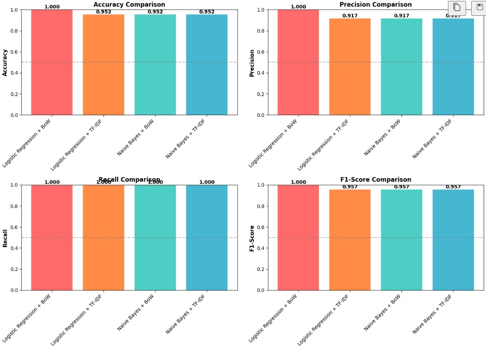
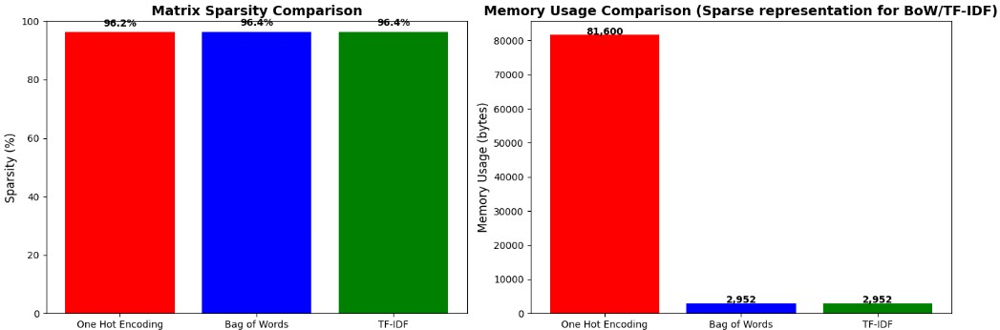
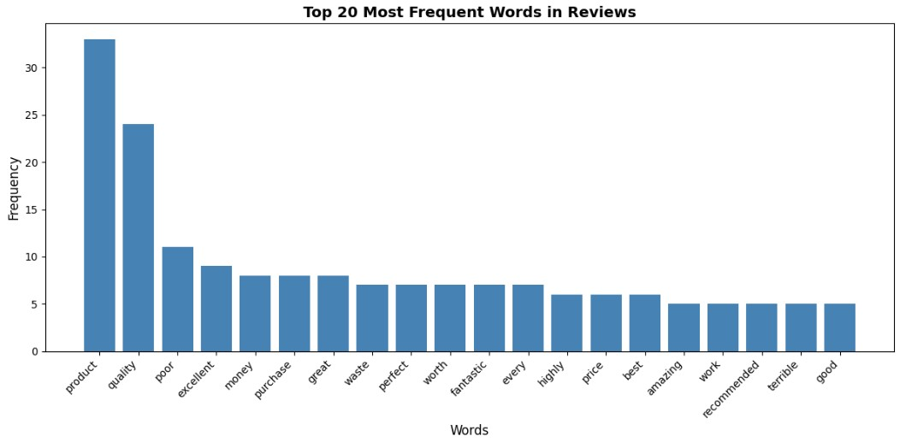

# 📊 Customer Reviews Text Analysis using NLP

🚀 NLP pipeline to transform customer reviews into numerical features and perform sentiment classification

---

## 🔍 Overview

This project builds an end-to-end Natural Language Processing (NLP) pipeline to process raw customer reviews and convert them into structured numerical features.

It demonstrates how traditional NLP techniques like Bag of Words and TF-IDF can be used for sentiment analysis.

---

## 📁 Dataset

* 100+ product reviews (Flipkart/Amazon-style dataset)
* Stored in CSV format with a `review_text` column

---

## ⚙️ Workflow

### 1. Text Preprocessing

* Lowercasing
* Tokenization
* Removal of punctuation
* Stopword removal
* Lemmatization

---

### 2. Feature Engineering Techniques

* **One Hot Encoding** (manual implementation)
* **Bag of Words (BoW)** using CountVectorizer
* **TF-IDF** using TfidfVectorizer

---

### 3. Vocabulary Analysis

* Built vocabulary from processed text
* Analyzed frequent words
* Evaluated vocabulary size

---

### 4. Sparse Matrix Analysis

* Generated feature matrices
* Calculated sparsity

👉 Observation:
Feature matrices are highly sparse (>90% zeros), which can impact performance in large-scale systems.

---

### 5. Sentiment Classification

* Logistic Regression
* Naive Bayes

**Goal:** Classify customer reviews into **positive** and **negative**

---

## 📊 Results

* TF-IDF performed better than Bag of Words in classification
* Bag of Words captures frequency but ignores importance
* TF-IDF highlights meaningful words

---

## 📸 Sample Outputs

### 🔹 Model Performance

<p align="center">
  
</p>

---

### 🔹 Sparse Matrix Analysis

<p align="center">
  
</p>

---

### 🔹 Top Words in Vocabulary

<p align="center">
  
</p>

---

## ⚖️ Comparison of Techniques

| Method           | Strength         | Limitation          |
| ---------------- | ---------------- | ------------------- |
| One Hot Encoding | Simple           | High dimensional    |
| Bag of Words     | Frequency-based  | No semantic meaning |
| TF-IDF           | Importance-based | Ignores context     |

---

## 🧠 Key Learnings

* Traditional NLP techniques do not capture semantic meaning
* Words with similar meaning (e.g., "good" vs "excellent") are treated differently
* Sparse matrices can be inefficient for large datasets

---

## ❓ Real-World Considerations

* **Why BoW fails?**
  It does not capture semantic similarity between words

* **When to use BoW vs TF-IDF?**

  * BoW → simple tasks like spam detection
  * TF-IDF → sentiment analysis and keyword importance

* **Limitations of TF-IDF**

  * Does not understand context
  * Ignores word order

---

## ▶️ How to Run

```bash
git clone https://github.com/shauryananda3/customer-review-text-analysis.git
cd customer-review-text-analysis
pip install -r requirements.txt
```

Open:

```bash
notebooks/Customer Reviews Analysis.ipynb
```

Run all cells.

---

## 🛠️ Tech Stack

* Python
* Pandas, NumPy
* Scikit-learn

---

## 📌 Conclusion

This project demonstrates how raw text data can be transformed into structured numerical features using NLP techniques, and highlights the strengths and limitations of traditional approaches like Bag of Words and TF-IDF.

---

## 🚀 Future Improvements

* Word Embeddings (Word2Vec, GloVe)
* Transformer models (BERT)
* Real-time deployment

---
